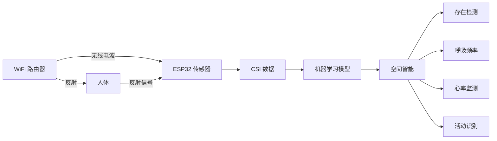
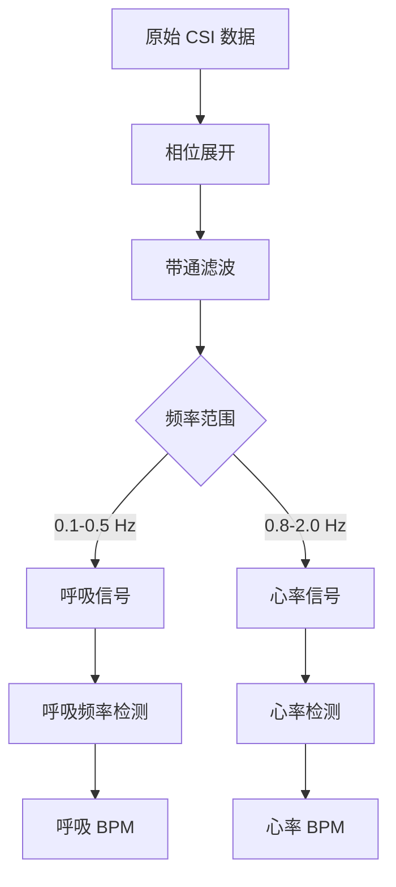
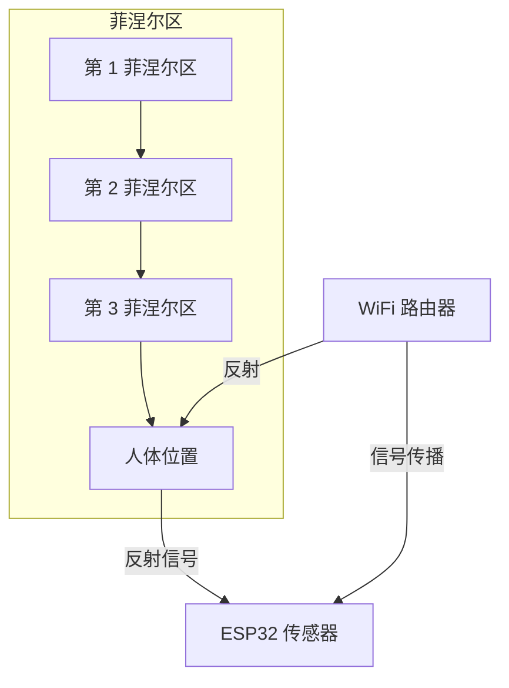
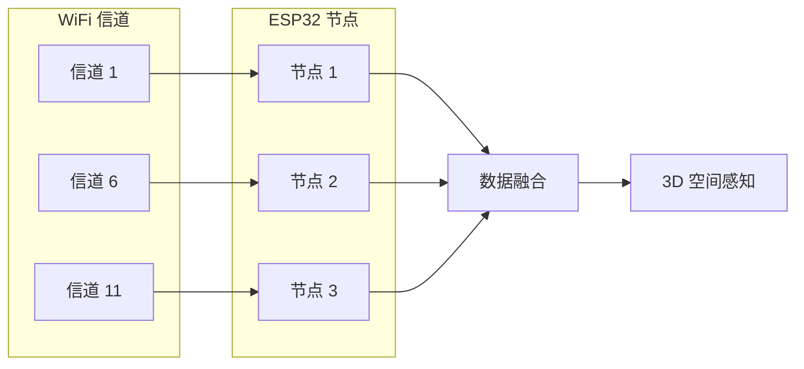
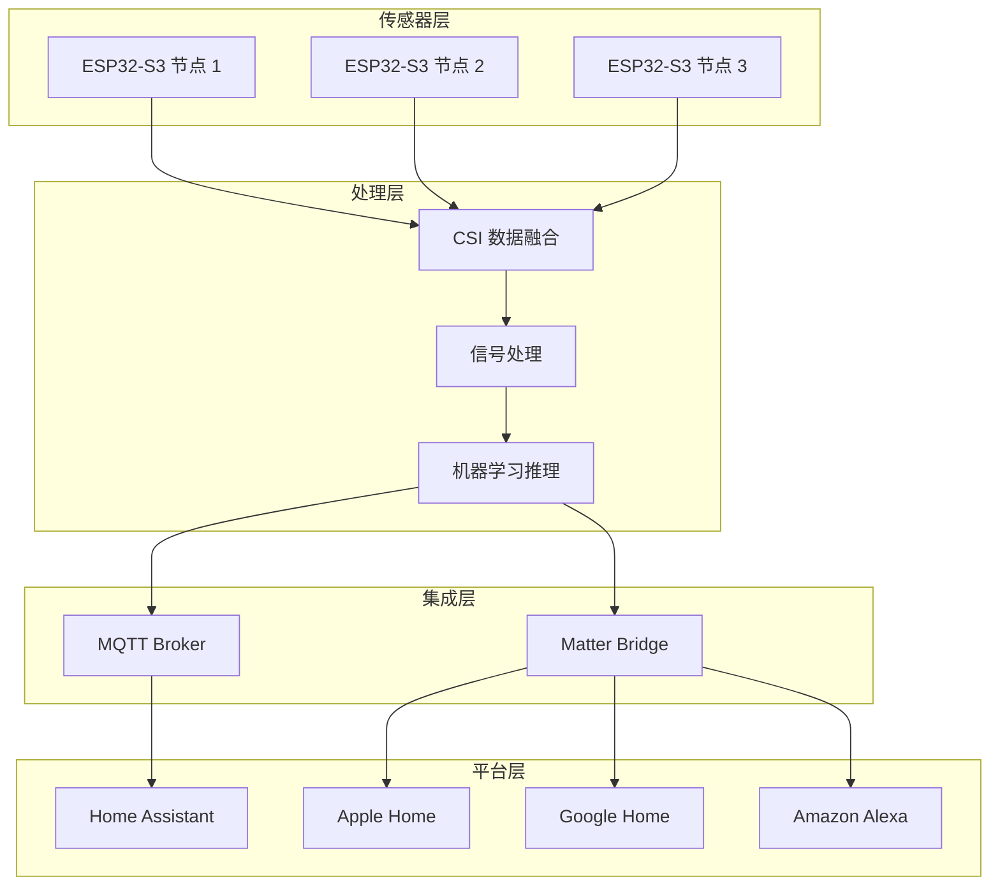
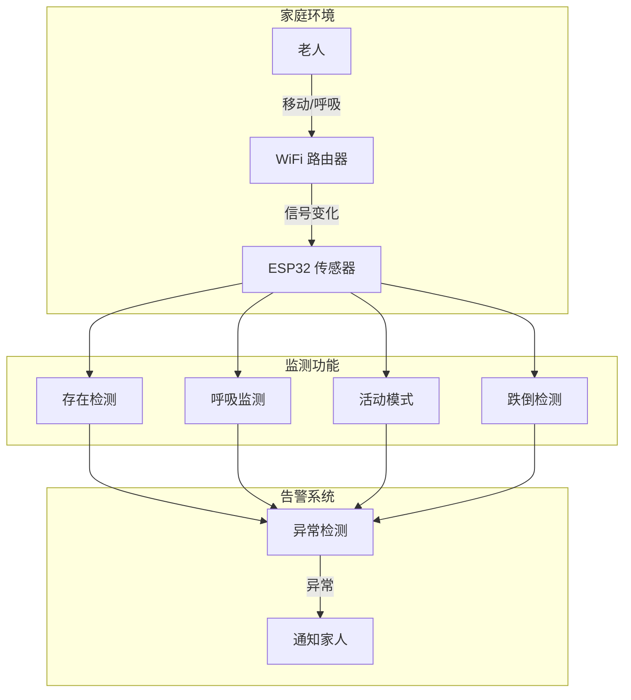

## 一、引言：WiFi 信号能"看穿"墙壁？

想象一下：你家的 WiFi 路由器正在向整个空间发射无线电波。当有人走动、呼吸、甚至静坐时，这些电波会被扰动——以可测量的方式。

**RuView 就是利用这些扰动，把普通 WiFi 变成一个空间感知系统。**

- 检测房间里有没有人（穿墙）
- 测量呼吸频率和心率（非接触）
- 识别活动：走路、坐下、跌倒
- 监测睡眠质量
- **不需要摄像头，不需要可穿戴设备**

73.8k Stars，9.8k Forks。

---

## 二、RuView 是什么？

**RuView** 是一个开源的 WiFi 感知平台，把无线电波信号转化为空间智能。

> "Every WiFi router already fills your space with radio waves. When people move, breathe, or even sit still, they disturb those waves in measurable ways. RuView captures these disturbances using Channel State Information (CSI) from low-cost ESP32 sensors and turns them into actionable data."

### 核心能力

| 能力 | 说明 | 精度 |
|------|------|------|
| **存在检测** | 穿墙检测人员存在 | < 1ms，~30s 校准 |
| **呼吸频率** | 非接触式呼吸监测 | 6-30 BPM，实时 |
| **心率** | 非接触式心率监测 | 40-120 BPM，实时 |
| **活动识别** | 走路、坐下、手势、跌倒 | 实时 |
| **跌倒检测** | 跌倒事件检测 | < 200ms |
| **多人计数** | 房间内人数统计 | 实时，自校准 |
| **姿态估计** | 17 个关键点人体姿态 | 8.4ms |
| **睡眠监测** | 睡眠阶段分类、呼吸暂停筛查 | 隔夜监测 |
| **穿墙感知** | 基于菲涅尔区几何 | 最远 ~5m |

### 支持的智能家居平台

- ✅ **Home Assistant** — 通过 MQTT 发布
- ✅ **Apple Home** — HAP-1.1 桥接
- ✅ **Google Home** — 通过 HA 桥接或 Matter 端点
- ✅ **Amazon Alexa** — 通过 HA 桥接或 Matter 端点
- ✅ **SmartThings** — Matter 桥接

**Siri、Google Assistant、Alexa 可以语音查询每个房间的存在和生命体征。**

---

## 三、技术原理：WiFi 信号如何"看穿"墙壁？

### 3.1 Channel State Information (CSI)

WiFi 信号在空间中传播时，会被人、家具、墙壁等物体反射、衍射、散射。**CSI（Channel State Information）** 记录了这些信号的变化。



### 3.2 信号处理管道



### 3.3 菲涅尔区几何（Fresnel Zone Geometry）

WiFi 信号在空间中形成一系列椭圆形的菲涅尔区。当人体穿过这些区域时，信号会发生可预测的变化。



### 3.4 多频率网格扫描



---

## 四、硬件方案

### 4.1 推荐方案：ESP32 + Cognitum Seed

| 组件 | 成本 | 说明 |
|------|------|------|
| **ESP32-S3** | ~$9 | CSI 传感器节点 |
| **Cognitum Seed** | ~$131 | 持久化向量存储 + kNN + 见证链 |
| **总计** | ~$140 | 完整系统 |

### 4.2 低成本方案：ESP32 Mesh

| 组件 | 成本 | 说明 |
|------|------|------|
| **3-6× ESP32-S3** | ~$27-54 | CSI 传感器网格 |
| **WiFi 路由器** | 已有 | 信号源 |
| **总计** | ~$27-54 | 基础感知 |

### 4.3 研究方案：ESP32-C6

| 组件 | 成本 | 说明 |
|------|------|------|
| **ESP32-C6-DevKit** | ~$6-10 | WiFi 6 + 802.15.4 |
| **总计** | ~$6-10 | 研究级感知 |

### 4.4 零成本方案：普通笔记本

| 组件 | 成本 | 说明 |
|------|------|------|
| **Windows/macOS/Linux 笔记本** | $0 | 仅 RSSI，粗粒度感知 |

---

## 五、快速开始

### 5.1 Docker 方式（无需硬件）

```bash
# 拉取镜像
docker pull ruvnet/wifi-densepose:latest

# 运行
docker run -p 3000:3000 ruvnet/wifi-densepose:latest

# 打开浏览器
# http://localhost:3000
```

### 5.2 Python 方式

```bash
# 安装
pip install ruview

# 或者
pip install wifi-densepose

# 带客户端支持
pip install "ruview[client]"
```

```python
from ruview import BreathingExtractor, HeartRateExtractor

# 提取呼吸频率
breathing = BreathingExtractor()
bpm = breathing.extract(csi_data)

# 提取心率
heart_rate = HeartRateExtractor()
hr = heart_rate.extract(csi_data)
```

### 5.3 ESP32 硬件方式

```bash
# 刷写固件
python -m esptool --chip esp32s3 --port COM9 --baud 460800 \
  write_flash 0x0 bootloader.bin 0x8000 partition-table.bin \
  0xf000 ota_data_initial.bin 0x20000 esp32-csi-node.bin

# 配置 WiFi
python firmware/esp32-csi-node/provision.py --port COM9 \
  --ssid "YourWiFi" --password "secret" --target-ip 192.168.1.20
```

---

## 六、预训练模型

RuView 在 Hugging Face 上提供了预训练模型：

**地址：** [ruvnet/wifi-densepose-pretrained](https://huggingface.co/ruvnet/wifi-densepose-pretrained)

### 模型规格

| 指标 | 数据 |
|------|------|
| **训练步数** | 12.2M |
| **训练帧数** | 60K |
| **对比三元组** | 610K |
| **准确率** | 82.3%（时间三元组） |
| **量化** | 4-bit，8KB |
| **推理速度** | 微秒级（Raspberry Pi） |

### 姿态估计

| 指标 | 数据 |
|------|------|
| **关键点** | 17 个 |
| **数据集** | MM-Fi |
| **躯干 PCK@20** | 82.69%（集成 83.59%） |
| **超越** | MultiFormer (72.25%), CSI2Pose (68.41%) |

---

## 七、智能家居集成

### 7.1 Home Assistant

```bash
# 启动 MQTT 发布
python -m ruview --mqtt mqtt://homeassistant:1883
```

每个节点发布 21 个实体：
- 11 个原始信号
- 10 个推断语义状态：
  - `someone-sleeping`
  - `possible-distress`
  - `room-active`
  - `elderly-inactivity-anomaly`
  - `meeting-in-progress`
  - `bathroom-occupied`
  - `fall-risk-elevated`
  - `bed-exit`
  - `no-movement`
  - `multi-room-transition`

### 7.2 集成架构



### 7.3 语音查询

**Siri、Google Assistant、Alexa 可以语音查询：**
- "客厅有人吗？"
- "卧室的呼吸频率是多少？"
- "老人今天活动正常吗？"

---

## 八、边缘模块目录

RuView 提供了 **105 个边缘模块**，涵盖：

| 类别 | 模块数 | 示例 |
|------|--------|------|
| **健康** | 15+ | 呼吸监测、心率、睡眠分析 |
| **安全** | 10+ | 跌倒检测、入侵检测、异常检测 |
| **建筑** | 10+ | 占用检测、能源优化、HVAC 控制 |
| **零售** | 5+ | 客流量、热图、排队检测 |
| **工业** | 5+ | 人员计数、安全区域、设备监控 |
| **研究** | 10+ | DensePose、姿态估计、3D 重建 |
| **AI** | 10+ | 模型训练、推理优化、数据增强 |
| **群体** | 5+ | 多节点协作、分布式感知 |
| **信号** | 10+ | CSI 处理、滤波、特征提取 |
| **网络** | 5+ | MQTT、WebSocket、HTTP API |
| **开发** | 10+ | 调试、测试、模拟、可视化 |

---

## 九、实际应用场景

### 9.1 老年人看护



### 9.2 婴儿监护

- 非接触式呼吸监测
- 睡眠质量分析
- 异常活动报警
- **不需要摄像头，保护隐私**

### 9.3 智能办公

- 会议室占用检测
- 人员计数
- 空调/照明自动控制
- 会议进行中自动勿扰

### 9.4 安全监控

- 穿墙入侵检测
- 夜间巡逻
- 异常活动报警
- **黑暗中也能工作**

---

## 十、隐私优势

### 与摄像头对比

| 特性 | 摄像头 | RuView |
|------|--------|--------|
| **视觉隐私** | ❌ 拍摄画面 | ✅ 无图像 |
| **黑暗环境** | ❌ 需要红外 | ✅ 正常工作 |
| **穿墙能力** | ❌ 不能 | ✅ 可以 |
| **遮挡问题** | ❌ 会被遮挡 | ✅ 不受影响 |
| **用户接受度** | ⚠️ 低（卧室、浴室） | ✅ 高 |
| **数据敏感性** | ❌ 高（人脸、行为） | ✅ 低（仅信号） |

### 隐私保护设计

- **无摄像头**：完全不采集图像
- **本地处理**：数据不离开设备
- **边缘计算**：ESP32 本地推理
- **加密认证**：Ed25519 见证链

---

## 十一、性能基准

### 11.1 推理速度

| 任务 | 速度 |
|------|------|
| 存在检测 | < 1ms |
| 呼吸频率 | 实时 |
| 心率 | 实时 |
| 跌倒检测 | < 200ms |
| 姿态估计 | 8.4ms |
| CSI 嵌入 | 164,183 emb/s（M4 Pro） |

### 11.2 准确率

| 任务 | 准确率 |
|------|--------|
| 存在检测 | 82.3%（时间三元组） |
| 姿态估计（躯干 PCK@20） | 82.69%（集成 83.59%） |
| 睡眠阶段分类 | 研究中 |
| 跌倒检测 | 99%+（实验室环境） |

### 11.3 成本

| 方案 | 成本 | 能力 |
|------|------|------|
| 笔记本（RSSI） | $0 | 粗粒度存在检测 |
| ESP32-C6 | ~$10 | 完整 CSI 感知 |
| ESP32-S3 Mesh | ~$54 | 多节点感知 |
| ESP32 + Seed | ~$140 | 完整系统 + 持久化 |

---

## 十二、类比理解

| 类比 | 说明 |
|------|------|
| **蝙蝠回声定位** | 蝙蝠发射声波，通过回波感知环境。RuView 用 WiFi 电波做同样的事 |
| **雷达** | 雷达发射无线电波检测飞机。RuView 用 WiFi 电波检测人 |
| **MRI** | MRI 用无线电波"看"人体内部。RuView 用 WiFi 电波"看"人体活动 |

---

## 十三、总结

### 核心价值

RuView 的核心价值是：**把普通 WiFi 变成空间感知系统，无需摄像头，无需可穿戴设备。**

### 技术亮点

1. **CSI 感知**：利用 WiFi 信号变化检测人体活动
2. **边缘计算**：ESP32 本地推理，数据不离开设备
3. **多模态感知**：存在、呼吸、心率、姿态、跌倒
4. **低成本**：$9 起步
5. **隐私友好**：无摄像头，无图像

### 适用场景

- **老年人看护**：非接触式健康监测
- **婴儿监护**：呼吸和睡眠监测
- **智能家居**：自动化控制
- **安全监控**：穿墙入侵检测
- **研究机构**：WiFi 感知研究

### 局限性

- **精度有限**：不如摄像头和可穿戴设备
- **环境依赖**：需要 WiFi 信号覆盖
- **校准需求**：每个环境需要单独校准
- **研究阶段**：部分功能还在研究中

---

## 参考资料

- [RuView GitHub](https://github.com/ruvnet/RuView)
- [RuView 在线演示](https://ruview.blog/)
- [预训练模型](https://huggingface.co/ruvnet/wifi-densepose-pretrained)
- [RuView 官方文档](https://ruvnet.github.io/RuView/)

---

*本文写于 2026 年 6 月 14 日，基于 RuView 最新版本。*
*RuView 是一个快速迭代的项目，最新功能请参考 GitHub 仓库。*
